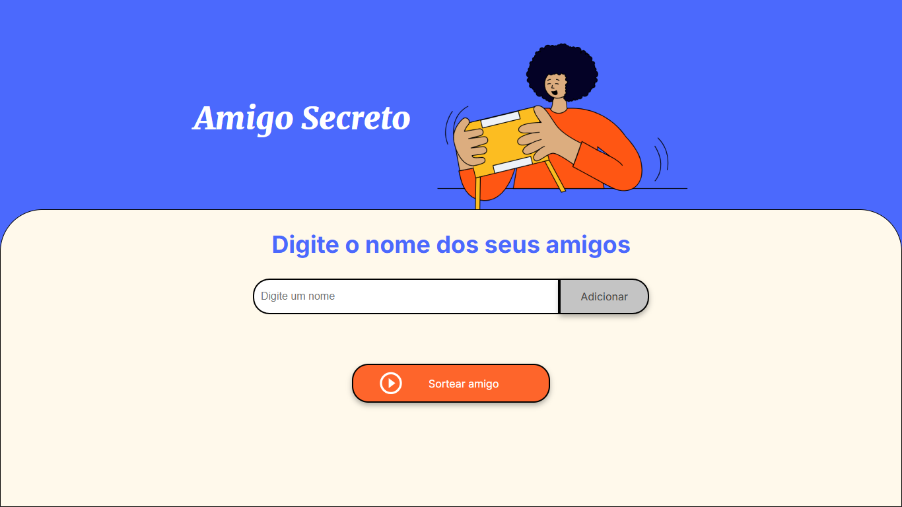

<h1>
 Amigo Secreto
</h1>

  
  
  
   

> Status do Projeto: :heavy_check_mark: :warning: (concluido, em desenvolvimento, etc)

### Tópicos 

:small_blue_diamond: [Descrição do projeto](#descrição-do-projeto)

:small_blue_diamond: [Funcionalidades](#funcionalidades)

:small_blue_diamond: [Funcionalidades Adicionais](#funcionalidades-adicionais)

:small_blue_diamond: [Deploy da Aplicação](#deploy-da-aplicação-dash)

:small_blue_diamond: [Pré-requisitos](#pré-requisitos)

:small_blue_diamond: [Como rodar a aplicação](#como-rodar-a-aplicação-arrow_forward)

... 

## Descrição do projeto 

  Neste desafio, será desenvolvido uma aplicação que permita ao usuário inserir nomes de amigos em uma lista para, em seguida, realizar um sorteio aleatório e determinar quem é o "amigo secreto".

  O usuário deverá adicionar nomes por meio de um campo de texto e de um botão "Adicionar".

  Os nomes inseridos serão exibidos em uma lista visível na página, e ao finalizar, um botão "Sortear Amigo" selecionará um dos nomes de forma aleatória, exibindo o resultado na tela

  O objetivo principal deste desafio é desenvolver habilidades em lógica de programação, por isso fornecemos o HTML e CSS já preparados. Dessa forma, você pode se concentrar exclusivamente em construir a lógica do código JavaScript, aplicando conceitos-chave como funções, arrays, condicionais e variáveis. Isso permitirá que você foque em resolver o problema e melhore o raciocínio lógico, sem se preocupar com a estrutura visual do projeto. 

## Funcionalidades

:heavy_check_mark: Adicionar nomes: Os usuários escreverão o nome de um amigo em um campo de texto e o adicionarão a uma lista visível ao clicar em "Adicionar".  

:heavy_check_mark: Validar entrada: Se o campo de texto estiver vazio, o programa exibirá um alerta solicitando um nome válido.  

:heavy_check_mark: Visualizar a lista: Os nomes inseridos aparecerão em uma lista abaixo do campo de entrada.  

:heavy_check_mark: Sorteio aleatório: Ao clicar no botão "Sortear Amigo", um nome da lista será selecionado aleatoriamente e exibido na página.  

## Funcionalidades Adicionais

:heavy_check_mark: Tecla Enter: Possibilidade de utilizar a tecla Enter do teclado, para adicionar o participante do sorteio de Amigo Secreto.  

:heavy_check_mark: Cadastro de participantes por nome e email/telefone: Cadastro dos nomes e seus respectivos números de telefone (com whatsapp ou envio por sms) ou o email. Ao ser realizado o sorteio dos participantes para definir seus respectivos amigos secreto, cada participante receberá um email ou mensagem no celular (whatsapp ou sms) com informações sobre o evento e que é o seu amigo secreto.  

:heavy_check_mark: Tabela de sorteados: Ao ser realizado o sorteio, será criado, automaticamente, uma tabela informando todos os participantes e seus respectivos amigo secreto.  

:heavy_check_mark: Novo Design: Criação de novo design para a aplicação criada.

:heavy_check_mark: Administrador: Será feito o cadastro de um administrador, o qual será responsável por cadastrar os participantes, realizar o sorteio e ter o acesso à tabela com os sorteados.

## Layout ou Deploy da Aplicação :dash:

> Link do deploy da aplicação. Exemplo com netlify: https://certificates-for-everyone-womakerscode.netlify.app/

... 

## Pré-requisitos
:...

## JSON :floppy_disk:

### Usuários: 

|name|email|password|token|avatar|
| -------- |-------- |-------- |-------- |-------- |
|N/D|N/D|N/D|N/D|N/D|

... 

## Linguagens, dependencias e libs utilizadas :books:

- [JavaScript](#)
- [HTML](#)
- [CSS](#)

...

## Tarefas em aberto

Tarefas e/ou Funcionalidades que ainda precisam ser implementadas na sua aplicação.

:memo: Cadastro de participantes por nome e email/telefone

:memo: Tabela de sorteados

:memo: Novo Design

:memo: Administrador

## Desenvolvedores/Contribuintes :octocat:

Liste o time responsável pelo desenvolvimento do projeto

| [ Manuel Fernandes](https://github.com/manuelfbfilho)|
| :---:

Copyright :copyright: Ano - Amigo Secreto
