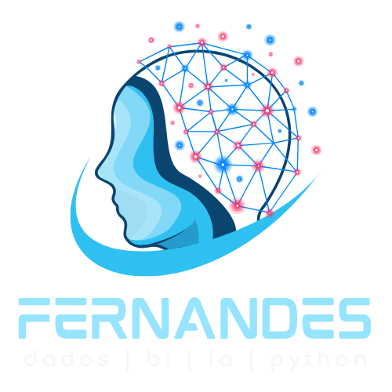

<!DOCTYPE html>
<html lang="pt-BR">
<head>
<meta charset="UTF-8">
<title>Setup Python Profissional no VSCode</title>

</head>
<body>

  <h1> Setup Profissional de Ambiente Python no VSCode</h1>
  
Este guia é uma referência completa para configurar seu ambiente Python no VSCode para projetos de:

  <ul>
    <li>🔬 Data Science & Análise de Dados</li>
    <li>🌐 Desenvolvimento Web com FastAPI/Flask/Streamlit</li>
    <li>🤖 Machine Learning e IA</li>
    <li>⚛️ Computação Quântica</li>
    <li>🖥️ Aplicações com interface gráfica (Tkinter, CLI)</li>
  </ul>

  <h2>📦 1. Verificando Instalação do Python</h2>
  <pre><code>python --version</code></pre>
  
Para Linux/macOS:

  <pre><code>python3 --version</code></pre>

  <h3>💡 Atualizar Python</h3>
  - Windows: baixar de <a href="https://www.python.org/downloads/windows/">python.org</a> 
  - Linux: use seu gerenciador de pacotes 
  - macOS: use <code>brew install python@3.12</code>

  <h2>✅ 2. Verificando o pip</h2>
  <pre><code>python -m pip --version</code></pre>

  <h2>💻 3. Criando Ambiente Virtual</h2>

  <h3>Windows CMD/PowerShell</h3>
  <pre><code>python -m venv venv
.\venv\Scripts\activate</code></pre>

  <h3>Git Bash (Windows)</h3>
  <pre><code>python -m venv venv
source venv/Scripts/activate</code></pre>

  <h3>Linux/macOS</h3>
  <pre><code>python3 -m venv venv
source venv/bin/activate</code></pre>

  <h3>🔴 Desativar o ambiente</h3>
  <pre><code>deactivate</code></pre>

  <h2>📄 4. Criando e Usando <code>requirements.txt</code></h2>
  
Para salvar dependências:

  <pre><code>pip freeze > requirements.txt</code></pre>

  
Para instalar tudo novamente:

  <pre><code>pip install -r requirements.txt</code></pre>

  <h2>🧠 5. Extensões Recomendadas para o VSCode</h2>

  <h3>🧪 Python / Data Science</h3>
  <ul>
    <li>Python (ms-python.python)</li>
    <li>Jupyter (ms-toolsai.jupyter)</li>
    <li>Pylance</li>
    <li>Python Environment Manager</li>
    <li>Jupyter Keymap</li>
  </ul>

  <h3>🌐 Web / FastAPI / Flask</h3>
  <ul>
    <li>REST Client</li>
    <li>Thunder Client</li>
    <li>Live Server</li>
    <li>FastAPI Snippets</li>
  </ul>

  <h3>🤖 Machine Learning / IA</h3>
  <ul>
    <li>Jupyter Notebooks</li>
    <li>Notebook Runner</li>
    <li>Kite Autocomplete (opcional)</li>
  </ul>

  <h3>⚛️ Computação Quântica</h3>
  <ul>
    <li>Qiskit (usar pip)</li>
    <li>IBM Quantum (plugin para notebooks)</li>
  </ul>

  <h3>🛠️ Dev Tools</h3>
  <ul>
    <li>Docker</li>
    <li>GitLens</li>
    <li>Markdown All in One</li>
    <li>Prettier</li>
    <li>Better Comments</li>
  </ul>

  <h3>🔄 Instalando todas as extensões pelo terminal:</h3>
  <pre><code>
code --install-extension ms-python.python
code --install-extension ms-toolsai.jupyter
code --install-extension ms-python.vscode-pylance
code --install-extension ms-azuretools.vscode-docker
code --install-extension ms-vscode.rest-client
code --install-extension ranga.vscode-fastapi
code --install-extension formulahendry.code-runner
  </code></pre>

  <h2>🚀 6. Executando Apps e Interfaces</h2>

  <h3>🖼️ Tkinter</h3>
  <pre><code>python app_tkinter.py</code></pre>

  <h3>🌐 Streamlit</h3>
  <pre><code>streamlit run app.py</code></pre>

  <h3>⚡ FastAPI + Uvicorn</h3>
  <pre><code>uvicorn app:app --reload</code></pre>
  
Acesse: <a href="http://127.0.0.1:8000" target="_blank">http://127.0.0.1:8000</a>

  
Docs interativas: <a href="http://127.0.0.1:8000/docs" target="_blank">/docs</a>

  <h2>🧱 7. Instalando pacotes dentro do venv</h2>
  
Após ativar o ambiente virtual, instale os pacotes normalmente com:

  <pre><code>pip install nome-do-pacote</code></pre>
  
Exemplo para Data Science + Dev:

  <pre><code>pip install numpy pandas matplotlib scikit-learn jupyterlab streamlit fastapi uvicorn qiskit</code></pre>

  <h2>🧹 8. Estrutura de Projeto Python Limpa</h2>
  <pre><code>
📁 meu_projeto/
│
├── 📁 venv/
├── 📁 src/
│   ├── __init__.py
│   ├── main.py
│   ├── utils.py
│
├── 📁 tests/
│   ├── test_main.py
│
├── requirements.txt
├── README.md
├── .gitignore
  </code></pre>

  
Para criar via terminal:

  <pre><code>
mkdir meu_projeto
cd meu_projeto
python -m venv venv
source venv/bin/activate  # ou .\venv\Scripts\activate no Windows
mkdir src tests
touch src/main.py src/utils.py tests/test_main.py requirements.txt .gitignore README.md
  </code></pre>

  <h2>✅ Fim! Ambiente completo e pronto para Python moderno!</h2>

</body>
</html>
